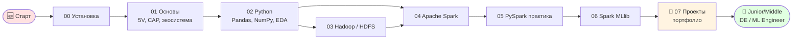

# 🧠 BIG DATA — учебный репозиторий на русском

[](./LICENSE)
[](https://www.python.org)
[](https://spark.apache.org)
[](#)
[](#)

> Полный курс по Big Data на русском языке: от концепций до распределённого ML на Apache Spark, с правовым контекстом (152-ФЗ, GDPR, AI Act).
> **24 000+ строк** учебного материала. **7 модулей** + 3 сквозных проекта. **Полностью бесплатный.**

📌 **Старт** → [00_введение](./00_введение/) → дальше по порядку.
📊 **Прогресс** → [ХОД_ИЗУЧЕНИЯ.md](./ХОД_ИЗУЧЕНИЯ.md)
🛠 **Установка (бесплатно)** → [ресурсы/среда_разработки.md](./ресурсы/среда_разработки.md)
📚 **Справочники и углублённые материалы** → [ресурсы/](./ресурсы/)
🗺 **Карта курса (sitemap)** → [КАРТА_КУРСА.md](./КАРТА_КУРСА.md)
🌳 **Карта компетенций** → [КАРТА_КОМПЕТЕНЦИЙ.md](./КАРТА_КОМПЕТЕНЦИЙ.md)
📈 **Диаграммы Mermaid** → [ресурсы/диаграммы.md](./ресурсы/диаграммы.md)
🎓 **Финальный экзамен** → [ФИНАЛЬНЫЙ_ЭКЗАМЕН.md](./ФИНАЛЬНЫЙ_ЭКЗАМЕН.md)
🚀 **Что дальше** → [ДАЛЬШЕ_ПОСЛЕ_КУРСА.md](./ДАЛЬШЕ_ПОСЛЕ_КУРСА.md)
📖 **Полная библиография** → [ресурсы/источники.md](./ресурсы/источники.md)

---

## 🗺 Путь обучения (рендерится на GitHub)



> 💰 **Курс полностью бесплатный.** Все технологии — open source: Python, Java, PySpark, Pandas, MLlib, Docker, VS Code, GitHub. Бесплатные облачные альтернативы без установки: Databricks Community, Google Colab, Kaggle Notebooks.

---

## 🏆 Что выделяет этот курс

- 🇷🇺 **На русском языке**, с гайдом по правильному смешению русского и английского в РФ-проектах.
- ⚖️ **Правовой контекст в каждом модуле** — 152-ФЗ, GDPR, AI Act, обезличивание, доказательственная сила ML.
- 🧠 **Сквозные смысловые связи** — концептуальная карта, глоссарий на 80+ терминов, 370+ внутренних ссылок.
- 💼 **3 сквозных проекта** с автогенерацией Model Card / Data Card — готовое портфолио.
- 🎯 **Углублённые материалы** — Spark Internals, streaming, тестирование, MLOps, performance tuning, интервью.
- 📊 **24 000+ строк** материала, **45 уроков**, **25+ практик**, **6 квизов + финальный экзамен**.

---

## 📦 Содержимое

| Раздел | Что внутри |
|--------|------------|
| **Модули 00–07** | Курс по порядку: от установки до продакшен-проектов |
| **ресурсы/** | Глоссарий, шпаргалки (Pandas/PySpark/HDFS/MLlib), правовой компендиум |
| **ресурсы/углублённое** | Spark Internals, streaming, тесты, MLOps, performance, интервью, реальные кейсы |
| **ресурсы/шаблоны** | MODEL_CARD / DATA_CARD по стандарту Google |
| **07_проекты** | Детекция аномалий, классификация юр.документов, ETL для регулярной отчётности |
| **аудиторские документы** | АУДИТ_СЛАБЫХ_МЕСТ + ФИНАЛЬНЫЙ_ЭКЗАМЕН + ДАЛЬШЕ_ПОСЛЕ_КУРСА |

---

## 🎯 Что мы изучим

К концу курса вы будете уметь:

1. **Понимать архитектуру Big Data** — Hadoop, HDFS, MapReduce, YARN, Spark, Kafka.
2. **Работать с PySpark** — обрабатывать датасеты, которые не помещаются в память.
3. **Строить ETL-пайплайны** — от сырых CSV до колоночного Parquet с партициями.
4. **Применять ML на больших данных** — Spark MLlib, распределённое обучение, Pipeline API.
5. **Делать осознанный выбор** — когда брать Spark, когда хватит Pandas, когда нужен Kafka, когда — нет.
6. **Учитывать правовые риски** — обезличивание, согласия, доказательственная сила ML-выводов.

---

## 🗺️ Дорожная карта (10–12 недель в интенсивном режиме)

| # | Модуль | Длит. | Ключевые темы | Артефакт по итогу |
|---|--------|------|---------------|-------------------|
| 00 | [Введение и окружение](./00_введение/) | 1–2 дня | Python, Java, Spark | Зелёная самопроверка + `Hello, Spark` |
| 01 | [Основы Big Data](./01_основы_BigData/) | 4–5 дней | 5V, экосистема, CAP, форматы | Квиз + анализ датасета по 5V |
| 02 | [Python для данных](./02_python_для_данных/) | 1 нед. | Pandas, NumPy, EDA | EDA-отчёт по реальному датасету |
| 03 | [Hadoop и HDFS](./03_hadoop_HDFS/) | 1 нед. | HDFS, YARN, MapReduce | Mini-MapReduce на Python |
| 04 | [Apache Spark — основы](./04_spark_основы/) | 1 нед. | RDD, DataFrame, lazy eval | Сравнение Pandas vs Spark на 10М строк |
| 05 | [PySpark — практика](./05_pyspark_практика/) | 2 нед. | ETL, join, window, partitioning | Полный ETL-пайплайн в Parquet |
| 06 | [Spark MLlib](./06_spark_MLlib/) | 2 нед. | Pipeline, классификация, кластеризация | ML-модель на распределённых данных |
| 07 | [Проекты](./07_проекты/) | 2 нед. | Сквозные кейсы | 2 проекта в портфолио |

🎓 Итог: репозиторий, который можно показать как учебное портфолио.

---

## 🧩 Карта зависимостей между темами

Каждая тема опирается на предыдущие. Если что-то «не идёт» — почти всегда не закрыт фундамент.

```
                          ┌─────────────────┐
                          │ 00 Окружение    │
                          └────────┬────────┘
                                   │
                          ┌────────▼────────┐
                          │ 01 Концепции    │  ← 5V, экосистема, CAP, форматы
                          └────────┬────────┘
                                   │
                          ┌────────▼────────┐
                          │ 02 Python/Pandas│  ← база для PySpark
                          └────────┬────────┘
                                   │
                ┌──────────────────┴──────────────────┐
                │                                     │
       ┌────────▼────────┐                  ┌─────────▼────────┐
       │ 03 Hadoop/HDFS  │                  │ 04 Spark Core    │
       │ (как хранить)   │                  │ (как считать)    │
       └────────┬────────┘                  └─────────┬────────┘
                │                                     │
                └──────────────────┬──────────────────┘
                                   │
                          ┌────────▼────────┐
                          │ 05 PySpark ETL  │  ← реальные пайплайны
                          └────────┬────────┘
                                   │
                          ┌────────▼────────┐
                          │ 06 Spark MLlib  │  ← распределённый ML
                          └────────┬────────┘
                                   │
                          ┌────────▼────────┐
                          │ 07 Проекты      │  ← сквозные кейсы
                          └─────────────────┘
```

---

## 🧠 Смысловые связи между концепциями

Это полезно понять **до того**, как начнёте кодить:

```
        ┌──────────── ХРАНЕНИЕ ────────────┐
        │  HDFS   ←  S3  ←  Object Store   │
        │   │                              │
        │   └→ Файлы:  CSV  Parquet  ORC   │ ← форматы важны
        └──────────────┬───────────────────┘
                       │ читаются через
        ┌──────────────▼───────────────────┐
        │       ОБРАБОТКА (compute)        │
        │  Spark Core (RDD)                │
        │  Spark SQL (DataFrame, Catalyst) │ ← оптимизатор
        │  Spark Streaming                 │
        └──────────────┬───────────────────┘
                       │ результаты
        ┌──────────────▼───────────────────┐
        │            ML / АНАЛИТИКА        │
        │  Spark MLlib  ← Pipeline API     │
        │  Spark SQL    ← BI-отчёты         │
        └──────────────────────────────────┘
                       │
        ┌──────────────▼───────────────────┐
        │       ПРАВО И БЕЗОПАСНОСТЬ       │ ← сквозной слой!
        │  152-ФЗ, GDPR, AI Act, ACL       │
        └──────────────────────────────────┘
```

Правовой слой — **сквозной**: он касается каждого этапа от хранения до выдачи модели. Подробнее: [ресурсы/правовые_аспекты.md](./ресурсы/правовые_аспекты.md).

---

## 📁 Структура репозитория

```
БигДата/
├── 00_введение/              старт: установка, проверка окружения
├── 01_основы_BigData/        теория + первые задания
├── 02_python_для_данных/     Pandas, NumPy, базовая аналитика
├── 03_hadoop_HDFS/           Hadoop-экосистема
├── 04_spark_основы/          Spark Core, RDD, DataFrame
├── 05_pyspark_практика/      реальные задачи на PySpark
├── 06_spark_MLlib/           распределённое ML
├── 07_проекты/               сквозные проекты
├── datasets/                 учебные данные (CSV, Parquet)
├── ресурсы/                  справочники, шпаргалки, право, книги
│   ├── глоссарий.md
│   ├── концептуальная_карта.md
│   ├── правовые_аспекты.md
│   ├── книги_и_курсы.md
│   └── шпаргалки/
├── ХОД_ИЗУЧЕНИЯ.md           чек-лист по всем модулям
├── requirements.txt          Python-пакеты
└── README.md                 этот файл
```

Внутри каждого модуля:

- `README.md` — обзор и цели
- `урок_*.md` — пошаговый разбор темы
- `практика_*.py` / `*.ipynb` — задания
- `решение_*.py` — эталон (открывать после своей попытки)
- `квиз_*.md` — проверка понимания
- `мои_заметки.md` — ваш конспект

---

## ⚙️ Стек технологий

- **Язык:** Python 3.10+ (с прицелом на PySpark)
- **Данные:** `pandas`, `numpy`, `pyarrow`, `fastparquet`
- **Big Data:** `pyspark` (Spark 3.5+), Hadoop streaming (mini-пример)
- **ML:** `scikit-learn`, `pyspark.ml` (MLlib)
- **Среда:** Jupyter Notebook / VS Code

Полный список: [requirements.txt](./requirements.txt).

---

## 🧭 Принципы курса

1. **Теория → пример → практика → мини-проект** — каждый урок.
2. **Никакого «магического» кода** — каждая нетривиальная строка объясняется.
3. **Юридический угол** интегрирован, а не приклеен сбоку.
4. **Pandas прежде PySpark** — иначе вы будете писать PySpark как Pandas, и это будет медленно.
5. **Сначала понять, потом запомнить** — синтаксис всегда можно подсмотреть в шпаргалке, мышление подсматривать негде.
6. **Контрольные точки** — квиз + мини-проект в конце каждого модуля.

---

## ✅ Как пользоваться

1. Идите по модулям по порядку: `00 → 01 → 02 → ...`.
2. В каждом модуле сначала прочтите `README.md`, потом — уроки в номерном порядке.
3. Делайте задания **самостоятельно**, потом сверяйтесь с `решение_*`.
4. После модуля — пройдите квиз и поставьте галочку в [ХОД_ИЗУЧЕНИЯ.md](./ХОД_ИЗУЧЕНИЯ.md).
5. Если что-то непонятно — посмотрите [глоссарий](./ресурсы/глоссарий.md) или [концептуальную карту](./ресурсы/концептуальная_карта.md).

---

## 🧑‍⚖️ Бонус для юриста

Сквозной правовой блок [ресурсы/правовые_аспекты.md](./ресурсы/правовые_аспекты.md) разбирает:

- **152-ФЗ vs GDPR** — что общего и в чём разница.
- **AI Act (ЕС, 2024)** — категории риска для ML-систем.
- **Псевдонимизация и анонимизация** — техника и юридическое значение.
- **Право на забвение** в распределённых системах (это сложнее, чем кажется).
- **Доказательственная сила** ML-выводов в суде.

В каждом модуле есть ссылка на соответствующий раздел компендиума.

---

## 🚦 Быстрая диагностика «где я нахожусь»

| Если вы умеете... | ...то начните с модуля |
|---|---|
| Не уверены, что такое CSV vs JSON | 00, потом 02 |
| Делали `df.groupby` в Pandas | 03 или 04 (но 02 пробегите) |
| Знаете SQL и Pandas, но Spark не запускали | 04 |
| Использовали PySpark `.read.csv()` | 05 |
| Обучали модели в scikit-learn | 06 после быстрого 04–05 |

---

## ❓ FAQ

**Зачем юристу Big Data?**
Чтобы (а) понимать, что технически возможно и что — нет, когда консультируете компанию по 152-ФЗ; (б) разговаривать с ML-командами на одном языке; (в) грамотно работать с цифровыми доказательствами.

**Сколько часов в день нужно?**
В интенсивном режиме — 1.5–2 часа. Меньше — растянется на 5–6 месяцев, и многое забудется.

**Можно ли пропустить Hadoop и сразу к Spark?**
Технически да, но вы будете не понимать ряда настроек Spark (партиции, локальность данных). Один день на 03 окупится.

**Нужен ли облачный кластер?**
Нет. Spark отлично работает локально в режиме `local[*]`. Облако подключим в проектах модуля 07, и то по желанию.

---

**Старт:** [00_введение/README.md](./00_введение/README.md)
