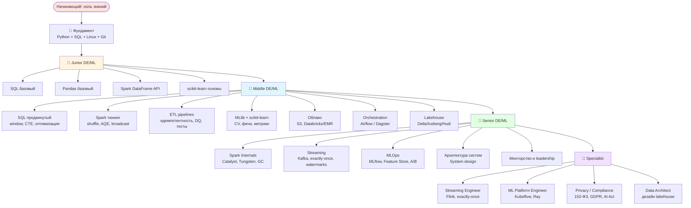

# 🗺 Карта компетенций Big Data

> Что я могу делать на каждом уровне. Подобие skill tree.
> Используйте для самопроверки: «я Junior?», «куда расти?», «что у меня уже есть?».

---

## 🌳 Дерево компетенций



---

## 💎 Фундамент (нужен для всех уровней)

| Навык | Что значит | Где осваивать |
|-------|------------|---------------|
| Python | Чистый Python 3.10+, ООП, типизация | [Модуль 00, 02](./00_введение/) |
| SQL базовый | SELECT, JOIN, GROUP BY, HAVING | Любой бесплатный курс |
| Linux CLI | bash, file system, ssh, vim/nano | learnlinux.tv |
| Git | clone, commit, push, branch | GitHub Learning Lab |
| English тех. | Читать документацию | Естественным путём через практику |

---

## 🥉 Junior уровень (0–1 год опыта)

После прохождения нашего курса до модуля 04 включительно — вы Junior.

### Технические навыки

- [ ] Уверенно пишу SQL: GROUP BY, JOIN всех типов, подзапросы.
- [ ] Знаю Pandas: загрузка, фильтрация, агрегаты, merge.
- [ ] Понимаю архитектуру Big Data (HDFS, Spark, S3 на схеме).
- [ ] Пишу PySpark DataFrame код для базовых трансформаций.
- [ ] Различаю transformation vs action.
- [ ] Читаю чужой Spark-код, понимаю что он делает.
- [ ] Использую scikit-learn для простых моделей.
- [ ] Делаю EDA с графиками (matplotlib/seaborn).

### Софт-скиллы
- [ ] Могу описать задачу в Issue/Jira.
- [ ] Делаю commit'ы регулярно.
- [ ] Понимаю code review.

### Контрольные точки нашего курса
- ✅ Пройден модуль 04 + квиз ≥ 16/20.
- ✅ Сделана практика 1–4 модуля 04.

**Зарплата (РФ, 2026):** 120–200k ₽.

---

## 🥈 Middle уровень (2–4 года опыта)

После прохождения курса до модуля 06 + углублённые материалы.

### Технические навыки

- [ ] **SQL глубоко:** window functions, recursive CTE, оптимизация по EXPLAIN, sessionization, cohort.
- [ ] **Spark тюнинг:** shuffle, broadcast, AQE, skew, lazy evaluation.
- [ ] **ETL pipelines:** идемпотентность, dynamic partition overwrite, DQ-проверки, тесты.
- [ ] **MLlib + scikit-learn:** Pipeline, CV, ParamGrid, метрики, feature importance.
- [ ] **Облако:** работа с S3/GCS, Databricks или EMR.
- [ ] **Orchestration:** запуск через Airflow / Dagster / cron.
- [ ] **Lakehouse-форматы:** Delta или Iceberg — могу применить.
- [ ] **Версии:** git flow, semantic versioning.

### Софт-скиллы
- [ ] Декомпозирую большую задачу.
- [ ] Делаю code review коллегам.
- [ ] Пишу понятный README, документирую.
- [ ] Могу провести 30-минутный design-discussion.

### Контрольные точки
- ✅ Финальный экзамен ≥ 38/50.
- ✅ Сделан хотя бы один из проектов модуля 07.
- ✅ Прочитан хотя бы один продвинутый ресурс из `ресурсы/` (Spark Internals или MLOps).

**Зарплата (РФ, 2026):** 200–400k ₽.

---

## 🥇 Senior уровень (5+ лет опыта)

После курса + 2–3 года реального проекта.

### Технические навыки

- [ ] **Spark Internals:** Catalyst, Tungsten, off-heap, GC, AQE — могу объяснить.
- [ ] **Streaming:** Kafka + Spark Structured Streaming, watermarks, exactly-once, late events.
- [ ] **MLOps:** MLflow + Model Registry + Feature Store + A/B testing.
- [ ] **System design:** проектирую с нуля Big Data платформу.
- [ ] **Performance debugging:** Spark UI читаю — диагноз ставлю за минуты.
- [ ] **Probabilistic DS:** HLL, Bloom filter, Count-Min Sketch — применяю.
- [ ] **Безопасность:** RBAC, encryption, ACL, Kerberos концептуально.

### Софт-скиллы
- [ ] Менторю Junior'ов.
- [ ] Веду архитектурные комитеты.
- [ ] Пишу спецификации фич.
- [ ] Презентую заказчику.
- [ ] Принимаю tech-решения за команду.

### Контрольные точки
- ✅ Все материалы курса пройдены.
- ✅ Сделаны все 3 проекта модуля 07.
- ✅ Свой open source вклад в Apache Spark / dbt / Airflow.

**Зарплата (РФ, 2026):** 400–700k ₽.

---

## 👑 Specialist tracks (5+ лет в нише)

После Senior можно специализироваться.

### 🌊 Streaming Engineer
- Apache Flink на уровне commit'ера или close to it.
- Kafka Streams / KSQL.
- Exactly-once семантика глубоко.
- Real-time ML inference.

**Где:** Tinkoff, Yandex (Logbroker), стриминг-сервисы.

### 🧠 ML Platform Engineer
- Kubeflow / Vertex AI / SageMaker — собрать ML-платформу с нуля.
- Feature Store на петабайтах.
- Online inference, GPU оркестрация.
- Model registry, версионирование.

**Где:** Sber AI, Yandex Cloud, Tinkoff ML, иностранные tech.

### 🔒 Privacy / Compliance Engineer (особенно для юриста)
- 152-ФЗ + GDPR + AI Act на уровне эксперта.
- DPIA, ROPA, DPA.
- Технические меры обезличивания (k-anonymity, дифф.приватность).
- Audit ML моделей.
- Сертификации: CIPP/E, CIPM, ISACA CISM.

**Где:** Compliance отделы банков, FAANG-like компании, юр.фирмы с tech-практикой.

### 🏗 Data Architect
- Проектирование от Bronze→Silver→Gold.
- Выбор Lakehouse формата под бизнес.
- Cost optimization кластеров.
- Migration legacy → cloud.

**Где:** Большие корпорации, консалтинг (Deloitte, McKinsey).

---

## 📋 Универсальный self-assessment

Поставьте себе 1–5 за каждый пункт. Сумма / 20 × 5 = ваш уровень в %.

```
SQL:
1 = SELECT, WHERE, GROUP BY
2 = JOIN, подзапросы
3 = Window functions, CTE
4 = Recursive CTE, оптимизация по EXPLAIN
5 = Query rewriter / dialect-specific особенности

Pandas:
1 = чтение CSV, фильтр, groupby
2 = merge, pivot, окна
3 = производительность, dtype оптимизация
4 = chunked I/O, Polars/DuckDB как замена
5 = Pandas API for Spark / pandas-ext

PySpark:
1 = SparkSession, read, simple transform
2 = groupBy, join, простые windows
3 = тюнинг shuffle, broadcast, AQE
4 = Catalyst планы, custom partitioner
5 = Spark Internals, contribute в open source

MLlib / scikit-learn:
1 = LR / RF из коробки
2 = Pipeline + CV
3 = Feature engineering custom
4 = MLOps end-to-end (MLflow, drift, A/B)
5 = ML Platform Engineer

System design:
1 = читаю чужие схемы
2 = рисую простые data flows
3 = проектирую batch pipeline
4 = проектирую gybrid (batch + streaming)
5 = архитектура на петабайтах

Право (для юриста):
1 = знаю термин «ПДн»
2 = читаю 152-ФЗ
3 = пишу политику обработки ПДн
4 = провожу DPIA
5 = AI Act + GDPR + 152-ФЗ на уровне эксперта
```

| Сумма | Уровень |
|-------|---------|
| 6–10 | Newcomer |
| 11–17 | Junior |
| 18–24 | Middle |
| 25–28 | Senior |
| 29–30 | Specialist |

---

## 🎯 Где я сейчас? (после прохождения курса)

Если вы только закончили курс — вы:

✅ **Junior гарантированно.** Все знания на бумаге есть, осталось получить опыт production.

⚠️ **Middle потенциально.** Нужно:
- 1–2 года реальной работы.
- Сделанные 2–3 production-pipeline'а.
- Опыт с реальными датасетами 100+ ГБ.
- Опыт работы в команде с code review.

❌ **Senior пока нет** — для senior нужны:
- 5+ лет.
- Проекты на петабайтах.
- Менторство и архитектурные решения.
- Опыт с инцидентами в production.

---

## 📊 Через сколько достичь Middle

Реалистичная траектория для человека после нашего курса:

```
Месяц 0: курс пройден.
Месяц 1-3: устроился джуниором.
   - Изучаю реальный стэк команды.
   - Делаю мелкие задачи под надзором.
Месяц 4-9: автономный джуниор.
   - Беру задачи целиком.
   - Делаю код-ревью себе.
Месяц 10-18: переходный уровень.
   - Беру средние задачи.
   - Учу junior'ов.
   - Архитектурные решения по части.
Месяц 19-24: Middle.
   - Беру большие задачи end-to-end.
   - Веду документацию.
   - Менторю.
```

Это **активная** траектория. Бывает быстрее (1 год) и медленнее (3 года).

---

## 💡 Главное правило

**Не торопитесь объявить себя «middle» только потому, что прошли курс.**

Курс даёт **знания**. Уровень — это **опыт + знания + софт-скиллы + ответственность**.

Junior, который год пилит pipeline в production — часто полезнее «middle» с тремя курсами в LinkedIn.
