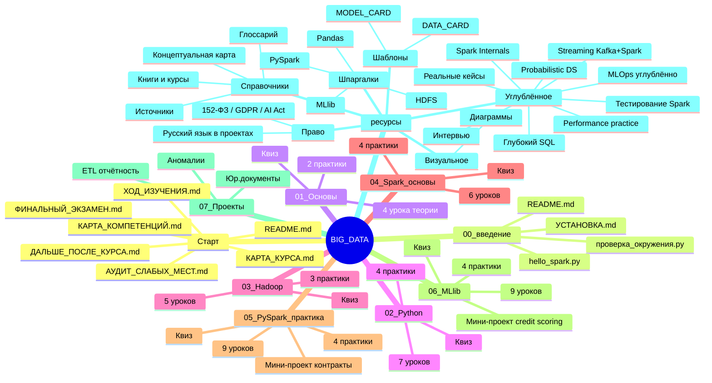
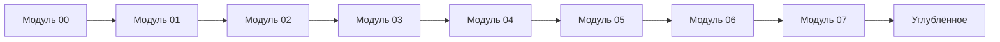
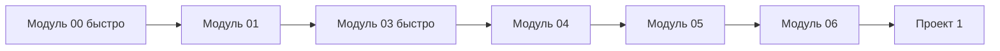
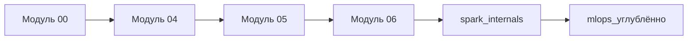
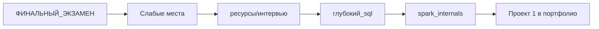
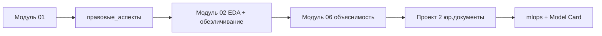
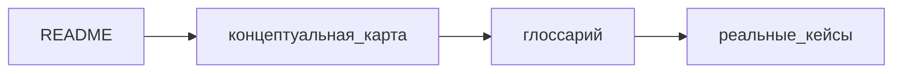

# 🗺 Карта курса (sitemap)

> Полная навигация по всем материалам. Mermaid-диаграммы рендерятся прямо на GitHub.

---

## 🧭 Полное дерево материалов

---

## 📂 Все файлы списком

### 🏠 Корень
- [README.md](./README.md) — главная страница
- [LICENSE](./LICENSE) — MIT
- [.gitignore](./.gitignore) — что не коммитить
- [CONTRIBUTING.md](./CONTRIBUTING.md) — как доработать
- [requirements.txt](./requirements.txt) — Python-пакеты
- [audit_links.py](./audit_links.py) — проверка ссылок
- [ХОД_ИЗУЧЕНИЯ.md](./ХОД_ИЗУЧЕНИЯ.md) — чек-лист
- [ФИНАЛЬНЫЙ_ЭКЗАМЕН.md](./ФИНАЛЬНЫЙ_ЭКЗАМЕН.md) — 50 вопросов
- [ДАЛЬШЕ_ПОСЛЕ_КУРСА.md](./ДАЛЬШЕ_ПОСЛЕ_КУРСА.md) — roadmap
- [АУДИТ_СЛАБЫХ_МЕСТ.md](./АУДИТ_СЛАБЫХ_МЕСТ.md) — критический разбор
- [КАРТА_КОМПЕТЕНЦИЙ.md](./КАРТА_КОМПЕТЕНЦИЙ.md) — skill tree
- [КАРТА_КУРСА.md](./КАРТА_КУРСА.md) — этот файл
- [ОТЧЁТ_О_РАБОТЕ.md](./ОТЧЁТ_О_РАБОТЕ.md) — отчёт о подготовке курса
- [PUBLISH_TO_GITHUB.md](./PUBLISH_TO_GITHUB.md) — инструкция по публикации

### 📘 Модуль 00 — Введение
- [README.md](./00_введение/README.md)
- [УСТАНОВКА.md](./00_введение/УСТАНОВКА.md)
- [проверка_окружения.py](./00_введение/проверка_окружения.py)
- [hello_spark.py](./00_введение/hello_spark.py)

### 📗 Модуль 01 — Основы Big Data
- [README.md](./01_основы_BigData/README.md)
- [Урок 1.1: Что такое Big Data, 5V](./01_основы_BigData/урок_1_что_такое_bigdata.md)
- [Урок 1.2: Экосистема](./01_основы_BigData/урок_2_экосистема.md)
- [Урок 1.3: Распределённые вычисления, CAP](./01_основы_BigData/урок_3_распределенные_вычисления.md)
- [Урок 1.4: Форматы хранения](./01_основы_BigData/урок_4_форматы_хранения.md)
- [Практика 1: Анализ 5V](./01_основы_BigData/практика_1_анализ_5V.py)
- [Решение 1](./01_основы_BigData/решение_1_анализ_5V.py)
- [Практика 2: Форматы](./01_основы_BigData/практика_2_форматы.py)
- [Квиз](./01_основы_BigData/квиз_модуль_01.md)

### 📙 Модуль 02 — Python для данных
- [README.md](./02_python_для_данных/README.md)
- [Урок 2.1: Pandas фундамент](./02_python_для_данных/урок_1_pandas_фундамент.md)
- [Урок 2.2: NumPy](./02_python_для_данных/урок_2_numpy.md)
- [Урок 2.3: Загрузка и очистка](./02_python_для_данных/урок_3_загрузка_и_очистка.md)
- [Урок 2.4: EDA](./02_python_для_данных/урок_4_eda.md)
- [Урок 2.5: GroupBy, join, windows](./02_python_для_данных/урок_5_groupby_join_windows.md)
- [Урок 2.6: Производительность](./02_python_для_данных/урок_6_производительность.md)
- [Урок 2.7: Обезличивание ПДн](./02_python_для_данных/урок_7_обезличивание.md)
- [Практика 1: EDA](./02_python_для_данных/практика_1_eda.py)
- [Решение 1](./02_python_для_данных/решение_1_eda.py)
- [Практика 2: Очистка](./02_python_для_данных/практика_2_очистка.py)
- [Решение 2](./02_python_для_данных/решение_2_очистка.py)
- [Практика 3: Обезличивание](./02_python_для_данных/практика_3_обезличивание.py)
- [Решение 3](./02_python_для_данных/решение_3_обезличивание.py)
- 🇷🇺 [Практика 4: Русский датасет](./02_python_для_данных/практика_4_русский_датасет.py)
- [Решение 4](./02_python_для_данных/решение_4_русский_датасет.py)
- [Квиз](./02_python_для_данных/квиз_модуль_02.md)

### 📕 Модуль 03 — Hadoop и HDFS
- [README.md](./03_hadoop_HDFS/README.md)
- [Урок 3.1: Архитектура Hadoop](./03_hadoop_HDFS/урок_1_архитектура_hadoop.md)
- [Урок 3.2: HDFS практика](./03_hadoop_HDFS/урок_2_hdfs_практика.md)
- [Урок 3.3: MapReduce](./03_hadoop_HDFS/урок_3_mapreduce.md)
- [Урок 3.4: Python Streaming](./03_hadoop_HDFS/урок_4_python_streaming.md)
- [Урок 3.5: Hadoop сегодня](./03_hadoop_HDFS/урок_5_hadoop_сегодня.md)
- [Практика 1: HDFS команды](./03_hadoop_HDFS/практика_1_hdfs_команды.md)
- [Практика 2: WordCount](./03_hadoop_HDFS/практика_2_wordcount/README.md)
- [Практика 3: Логи](./03_hadoop_HDFS/практика_3_логи/README.md)
- [Квиз](./03_hadoop_HDFS/квиз_модуль_03.md)

### 📒 Модуль 04 — Spark основы
- [README.md](./04_spark_основы/README.md)
- [Урок 4.1: Архитектура](./04_spark_основы/урок_1_архитектура.md)
- [Урок 4.2: SparkSession и RDD](./04_spark_основы/урок_2_session_rdd.md)
- [Урок 4.3: DataFrame API](./04_spark_основы/урок_3_dataframe.md)
- [Урок 4.4: Spark SQL и Catalyst](./04_spark_основы/урок_4_spark_sql.md)
- [Урок 4.5: Lazy evaluation](./04_spark_основы/урок_5_lazy.md)
- [Урок 4.6: Pandas vs Spark](./04_spark_основы/урок_6_pandas_vs_spark.md)
- [Практика 1: Первые шаги](./04_spark_основы/практика_1_первые_шаги.py)
- [Практика 2: SQL](./04_spark_основы/практика_2_sql.py)
- [Практика 3: Pandas vs Spark](./04_spark_основы/практика_3_pandas_vs_spark.py)
- [Практика 4: Explain](./04_spark_основы/практика_4_explain.py)
- [Квиз](./04_spark_основы/квиз_модуль_04.md)

### 📓 Модуль 05 — PySpark практика
- [README.md](./05_pyspark_практика/README.md)
- [Урок 5.1: ETL](./05_pyspark_практика/урок_1_etl.md)
- [Урок 5.2: Очистка](./05_pyspark_практика/урок_2_очистка.md)
- [Урок 5.3: Joins](./05_pyspark_практика/урок_3_joins.md)
- [Урок 5.4: Windows](./05_pyspark_практика/урок_4_windows.md)
- [Урок 5.5: Партиционирование](./05_pyspark_практика/урок_5_партиционирование.md)
- [Урок 5.6: Тюнинг](./05_pyspark_практика/урок_6_тюнинг.md)
- [Урок 5.7: Caching](./05_pyspark_практика/урок_7_caching.md)
- [Урок 5.8: Псевдонимизация](./05_pyspark_практика/урок_8_псевдонимизация.md)
- [Урок 5.9: Delta Lake](./05_pyspark_практика/урок_9_delta.md)
- [Практика 1: ETL](./05_pyspark_практика/практика_1_etl.py)
- [Практика 2: Joins](./05_pyspark_практика/практика_2_joins.py)
- [Практика 3: Windows](./05_pyspark_практика/практика_3_windows.py)
- [Практика 4: Skew](./05_pyspark_практика/практика_4_skew.py)
- [Мини-проект: Контракты](./05_pyspark_практика/мини_проект_контракты.py)
- [Квиз](./05_pyspark_практика/квиз_модуль_05.md)

### 📔 Модуль 06 — Spark MLlib
- [README.md](./06_spark_MLlib/README.md)
- [Урок 6.1: Архитектура MLlib](./06_spark_MLlib/урок_1_архитектура_mllib.md)
- [Урок 6.2: Feature engineering](./06_spark_MLlib/урок_2_feature_engineering.md)
- [Урок 6.3: Классификация](./06_spark_MLlib/урок_3_классификация.md)
- [Урок 6.4: Регрессия](./06_spark_MLlib/урок_4_регрессия.md)
- [Урок 6.5: Кластеризация](./06_spark_MLlib/урок_5_кластеризация.md)
- [Урок 6.6: Текст](./06_spark_MLlib/урок_6_text.md)
- [Урок 6.7: CV / Tuning](./06_spark_MLlib/урок_7_cv_tuning.md)
- [Урок 6.8: Save / Load](./06_spark_MLlib/урок_8_save_load.md)
- [Урок 6.9: Объяснимость](./06_spark_MLlib/урок_9_объяснимость.md)
- [Практика 1: Pipeline](./06_spark_MLlib/практика_1_pipeline.py)
- [Практика 2: Grid search](./06_spark_MLlib/практика_2_grid_search.py)
- [Практика 3: Clustering](./06_spark_MLlib/практика_3_clustering.py)
- [Практика 4: Text](./06_spark_MLlib/практика_4_text.py)
- [Мини-проект: Credit scoring](./06_spark_MLlib/мини_проект_credit_scoring.py)
- [Квиз](./06_spark_MLlib/квиз_модуль_06.md)

### 🎯 Модуль 07 — Сквозные проекты
- [README.md](./07_проекты/README.md)
- [Проект 1: Аномалии](./07_проекты/проект_1_аномалии/README.md)
- [Проект 2: Юр.документы](./07_проекты/проект_2_юр_документы/README.md)
- [Проект 3: ETL отчётность](./07_проекты/проект_3_etl_отчётность/README.md)

### 📚 ресурсы/
- [README.md](./ресурсы/README.md) — навигация
- [среда_разработки.md](./ресурсы/среда_разработки.md) — большой гайд по установке
- [глоссарий.md](./ресурсы/глоссарий.md) — 80+ терминов
- [концептуальная_карта.md](./ресурсы/концептуальная_карта.md) — 4 слоя Big Data
- [правовые_аспекты.md](./ресурсы/правовые_аспекты.md) — 152-ФЗ / GDPR / AI Act
- [книги_и_курсы.md](./ресурсы/книги_и_курсы.md) — рекомендации
- [источники.md](./ресурсы/источники.md) — paper'ы, законы, документация
- [русский_язык_в_проектах.md](./ресурсы/русский_язык_в_проектах.md)
- [диаграммы.md](./ресурсы/диаграммы.md) — Mermaid-визуализации

#### Углублённое
- [глубокий_sql.md](./ресурсы/глубокий_sql.md)
- [spark_internals.md](./ресурсы/spark_internals.md)
- [streaming_kafka_spark.md](./ресурсы/streaming_kafka_spark.md)
- [тестирование_spark.md](./ресурсы/тестирование_spark.md)
- [probabilistic_ds.md](./ресурсы/probabilistic_ds.md)
- [performance_practice.md](./ресурсы/performance_practice.md)
- [mlops_углублённо.md](./ресурсы/mlops_углублённо.md)
- [реальные_кейсы.md](./ресурсы/реальные_кейсы.md)
- [интервью.md](./ресурсы/интервью.md)

#### Шпаргалки
- [pandas.md](./ресурсы/шпаргалки/pandas.md)
- [pyspark.md](./ресурсы/шпаргалки/pyspark.md)
- [hdfs_hadoop.md](./ресурсы/шпаргалки/hdfs_hadoop.md)
- [spark_mllib.md](./ресурсы/шпаргалки/spark_mllib.md)

#### Шаблоны
- [MODEL_CARD_TEMPLATE.md](./ресурсы/шаблоны/MODEL_CARD_TEMPLATE.md)
- [DATA_CARD_TEMPLATE.md](./ресурсы/шаблоны/DATA_CARD_TEMPLATE.md)

---

## 🛤 Альтернативные траектории прохождения

Не все хотят учиться по порядку. Вот **5 траекторий** для разных целей.

### 🛤 Траектория 1: «Хочу всё с нуля» (12 недель)

Стандартный путь. 1–2 часа в день × 12 недель.

### 🛤 Траектория 2: «Я уже знаю Python и Pandas» (6 недель)

Пропускаем модуль 02. Hadoop — поверхностно.

### 🛤 Траектория 3: «Я ML-практик, хочу освоить Spark» (4 недели)

Сразу к Spark. После — Internals + MLOps.

### 🛤 Траектория 4: «Готовлюсь к интервью» (3 недели)

Self-assessment → точечно подтянуть → отрепетировать.

### 🛤 Траектория 5: «Я юрист, хочу понимать ML-команду» (2 недели)

Фокус на концепции и право, не на код.

### 🛤 Траектория 6: «Просто посмотреть» (1 час)

Обзор за час чтения.

---

## 🔍 Поиск по темам

### Хочу узнать про X — где это?

| Тема | Файл |
|------|------|
| Установка | [00_введение/УСТАНОВКА.md](./00_введение/УСТАНОВКА.md) |
| 5V | [01_основы/урок_1](./01_основы_BigData/урок_1_что_такое_bigdata.md) |
| CAP теорема | [01_основы/урок_3](./01_основы_BigData/урок_3_распределенные_вычисления.md) |
| Parquet | [01_основы/урок_4](./01_основы_BigData/урок_4_форматы_хранения.md) |
| Pandas | [02_python/урок_1](./02_python_для_данных/урок_1_pandas_фундамент.md) |
| NumPy | [02_python/урок_2](./02_python_для_данных/урок_2_numpy.md) |
| EDA | [02_python/урок_4](./02_python_для_данных/урок_4_eda.md) |
| Обезличивание | [02_python/урок_7](./02_python_для_данных/урок_7_обезличивание.md) |
| HDFS архитектура | [03_hadoop/урок_1](./03_hadoop_HDFS/урок_1_архитектура_hadoop.md) |
| MapReduce | [03_hadoop/урок_3](./03_hadoop_HDFS/урок_3_mapreduce.md) |
| Spark архитектура | [04_spark/урок_1](./04_spark_основы/урок_1_архитектура.md) |
| Catalyst | [04_spark/урок_4](./04_spark_основы/урок_4_spark_sql.md) и [spark_internals](./ресурсы/spark_internals.md) |
| Lazy evaluation | [04_spark/урок_5](./04_spark_основы/урок_5_lazy.md) |
| ETL | [05_pyspark/урок_1](./05_pyspark_практика/урок_1_etl.md) |
| Joins | [05_pyspark/урок_3](./05_pyspark_практика/урок_3_joins.md) |
| Skew | [05_pyspark/урок_6](./05_pyspark_практика/урок_6_тюнинг.md) |
| Delta Lake | [05_pyspark/урок_9](./05_pyspark_практика/урок_9_delta.md) |
| Pipeline MLlib | [06_mllib/урок_1](./06_spark_MLlib/урок_1_архитектура_mllib.md) |
| Feature engineering | [06_mllib/урок_2](./06_spark_MLlib/урок_2_feature_engineering.md) |
| Объяснимость, AI Act | [06_mllib/урок_9](./06_spark_MLlib/урок_9_объяснимость.md) |
| Streaming | [streaming_kafka_spark](./ресурсы/streaming_kafka_spark.md) |
| Тестирование | [тестирование_spark](./ресурсы/тестирование_spark.md) |
| MLOps | [mlops_углублённо](./ресурсы/mlops_углублённо.md) |
| Performance | [performance_practice](./ресурсы/performance_practice.md) |
| Интервью | [интервью](./ресурсы/интервью.md) |
| 152-ФЗ / GDPR | [правовые_аспекты](./ресурсы/правовые_аспекты.md) |

---

Этот файл — индекс. Заглядывайте сюда, когда «где это было?».
