# 📊 Визуальные диаграммы курса

> Все важные диаграммы в одном месте. Mermaid рендерится прямо на GitHub.
> Можно копировать в свои уроки и проекты.

---

## 1. Карта курса

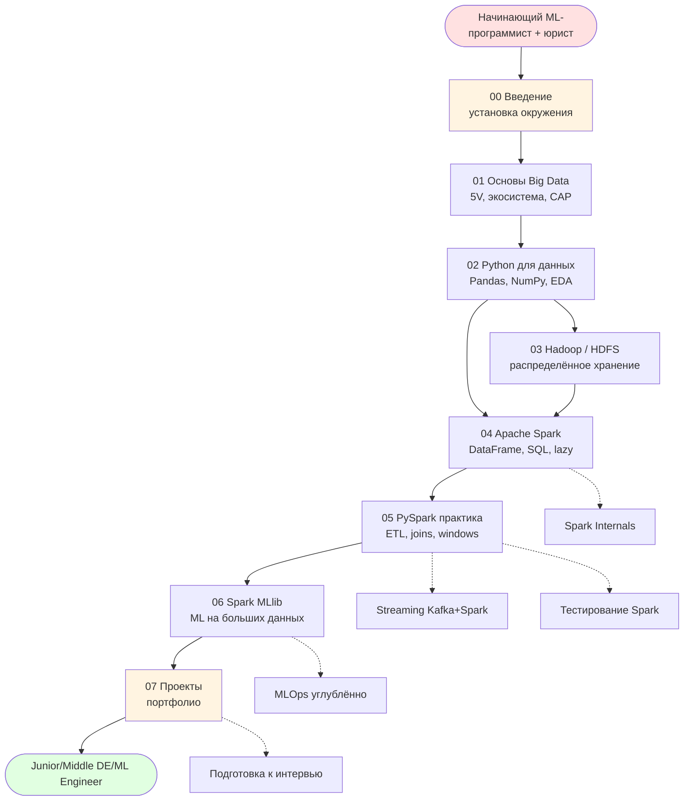

---

## 2. Архитектура Spark

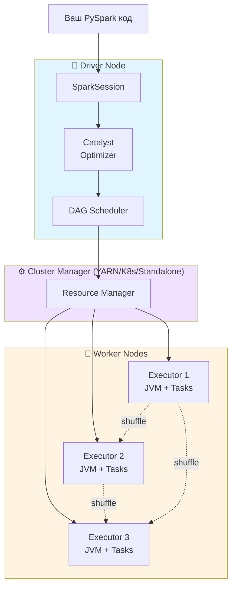

---

## 3. Транзакция / парадигма MapReduce

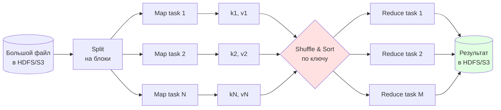

---

## 4. Lazy evaluation в Spark

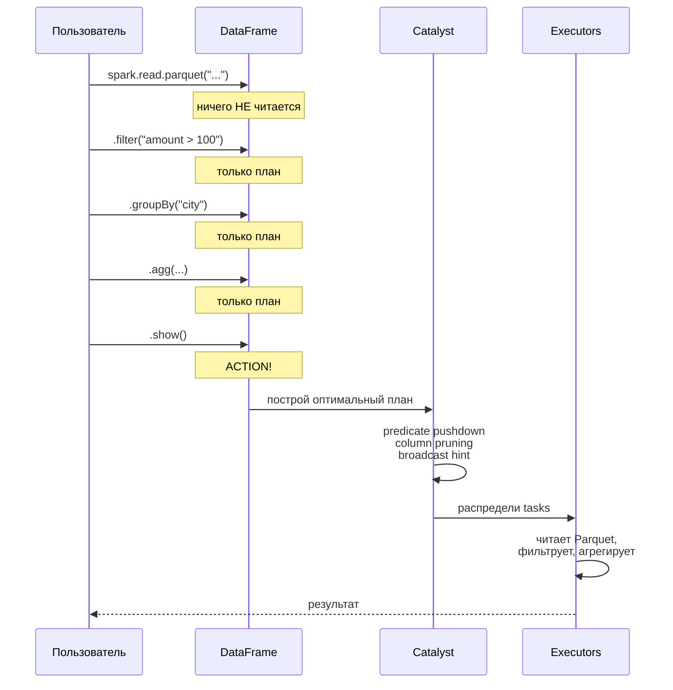

---

## 5. ETL pipeline (идеомпотентный)

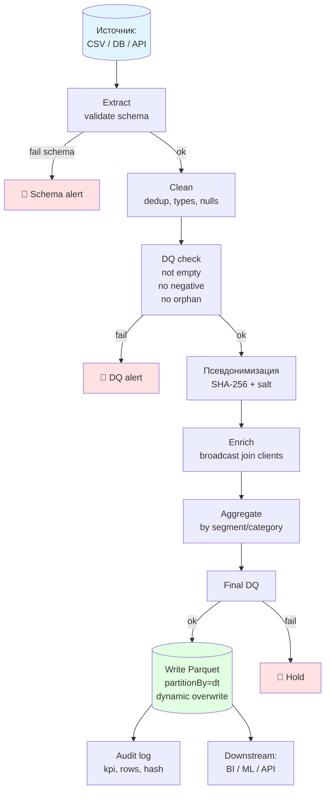

---

## 6. MLOps жизненный цикл модели

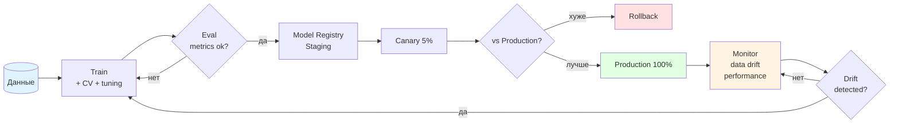

---

## 7. Pipeline MLlib

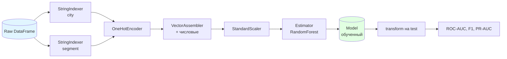

---

## 8. AI Act категории риска

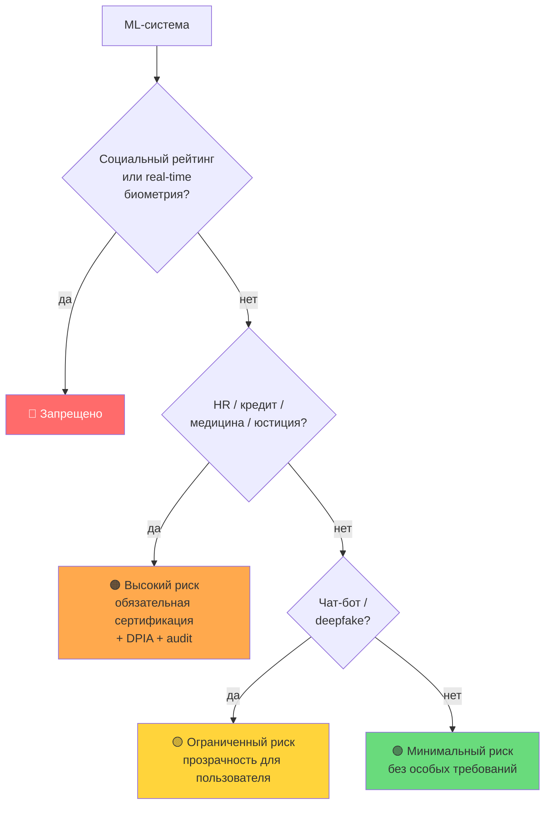

---

## 9. Обработка ПДн по 152-ФЗ

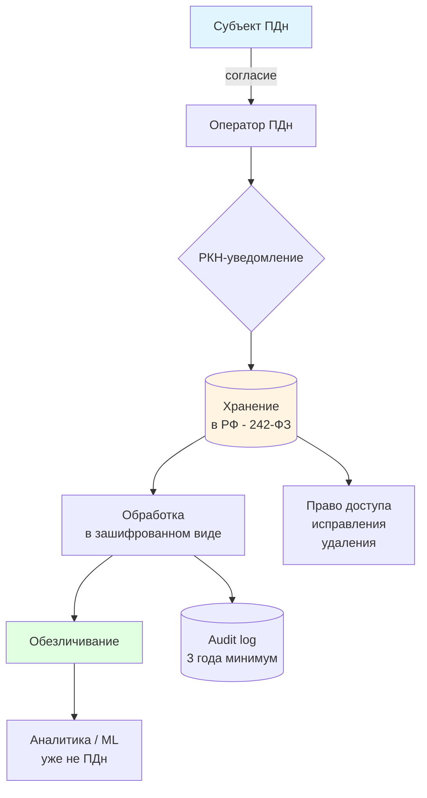

---

## 10. Жизненный цикл данных в Lakehouse

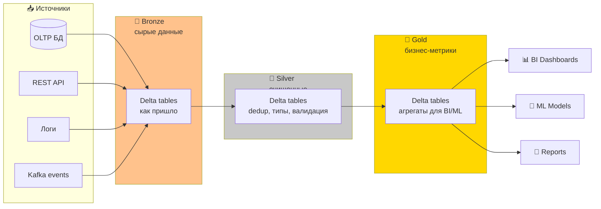

---

## 11. K-анонимность

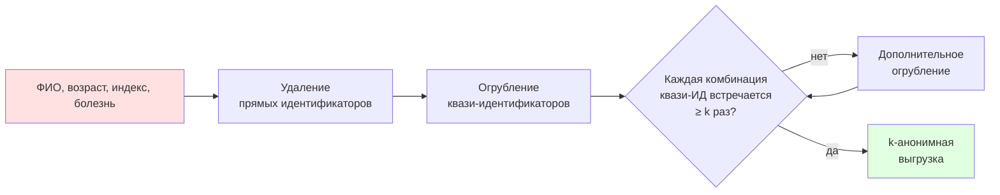

---

## 12. Стэк современной Big Data платформы (2026)

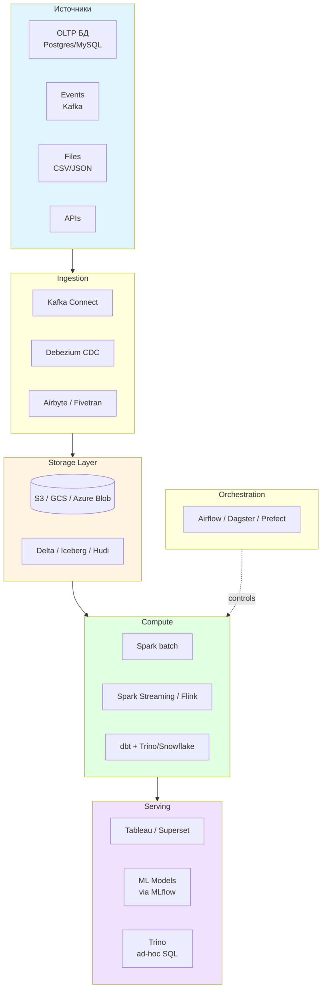

---

## 13. Чтение этих диаграмм

Все они написаны на **Mermaid** — language для диаграмм в markdown.

✅ **Где работает:**
- GitHub (нативно).
- GitLab.
- VS Code (с расширением).
- Obsidian.
- HackMD, Notion.

❌ **Где НЕ работает:**
- Обычный markdown viewer.
- PDF-экспорт без специальной обработки.

Чтобы посмотреть на GitHub — просто откройте этот файл, GitHub отрендерит диаграммы автоматически.

Чтобы экспортировать в PNG/SVG: **Mermaid Live Editor** https://mermaid.live/

---

## 14. Шаблон для своих диаграмм

Минимум для flowchart:
````markdown
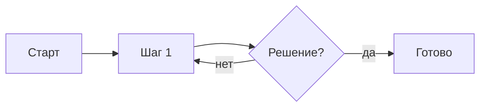
````

Минимум для sequence:
````markdown
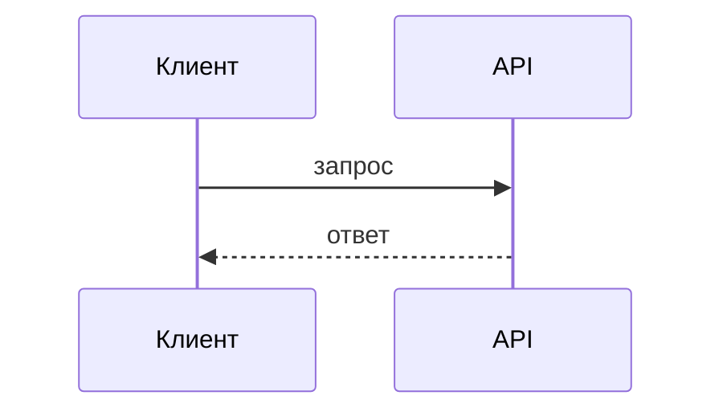
````

Документация Mermaid: https://mermaid.js.org/
